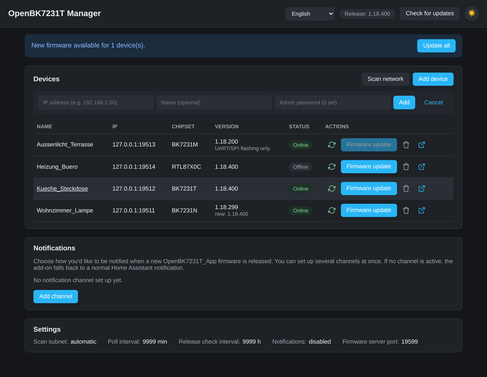

# Home Assistant Add-on Repository

This repository contains the **OpenBK7231T Manager** add-on for Home
Assistant. It finds [OpenBK7231T_App](https://github.com/openshwprojects/OpenBK7231T_App)/OpenBeken
devices on your local network, shows their live sensor data, updates their
firmware over the air, notifies you about new firmware releases, and helps
you migrate a device from ESPHome to OpenBeken (and back) — all locally,
with no cloud service or MQTT required, and with a mobile-friendly UI.

## Installation

1. In Home Assistant, go to **Settings → Add-ons → Add-on Store**.
2. Click the three dots in the top right → **Repositories**.
3. Paste this GitHub repository's URL and confirm.
4. The **OpenBK7231T Manager** add-on now shows up in the list — open it,
   click **Install**, then **Start**.

Detailed usage instructions, configuration options, and the full version
history are in
[`openbk7231t_manager/DOCS.md`](openbk7231t_manager/DOCS.md) (German) and
[`openbk7231t_manager/CHANGELOG.md`](openbk7231t_manager/CHANGELOG.md)
(English).

## License

Licensed under the [MIT License](LICENSE) — free to use, modify, and
redistribute, including commercially, as long as the license notice is
kept.
