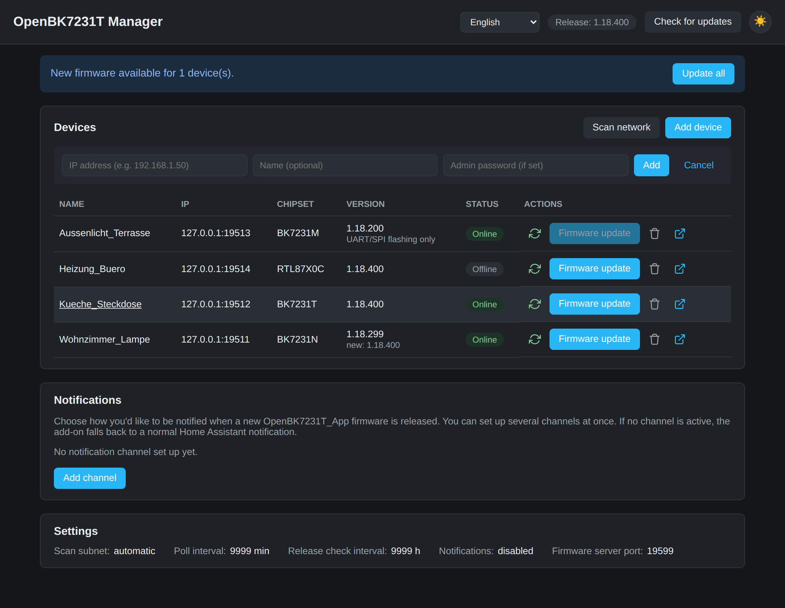

# Home Assistant Add-on Repository

This repository contains the **OpenBK7231T Manager** add-on for Home
Assistant. It finds [OpenBK7231T_App](https://github.com/openshwprojects/OpenBK7231T_App)/OpenBeken
devices on your local network, shows their live sensor data, updates their
firmware over the air, and notifies you about new firmware releases — all
locally, with no cloud service or MQTT required, and with a
mobile-friendly UI.

It also includes a dedicated **ESPHome ↔ OpenBeken migration** page: pick
the chip or module a device currently runs under ESPHome, and the add-on
downloads the matching OpenBeken firmware and packages it as a
ready-to-flash `.uf2` file, which you then upload yourself through
ESPHome's own OTA update page — no UART or chip programmer needed. The
same page can also read an existing ESPHome YAML config and translate its
GPIO-based switches, buttons and lights into the equivalent OpenBeken
commands, and send them straight to the freshly flashed device.

## Languages

The add-on's UI is available in all 24 official EU languages, plus
English (US): Bulgarian, Croatian, Czech, Danish, Dutch, English, English
(US), Estonian, Finnish, French, German, Greek, Hungarian, Irish,
Italian, Latvian, Lithuanian, Maltese, Polish, Portuguese, Romanian,
Slovak, Slovenian, Spanish and Swedish. This covers both the main device
list and the ESPHome ↔ OpenBeken migration page, and Home Assistant's own
add-on configuration screen is translated into all of them too.

## Installation

1. In Home Assistant, go to **Settings → Add-ons → Add-on Store**.
2. Click the three dots in the top right → **Repositories**.
3. Paste this GitHub repository's URL and confirm.
4. The **OpenBK7231T Manager** add-on now shows up in the list — open it,
   click **Install**, then **Start**.

Detailed usage instructions, configuration options, and the full version
history are in
[`openbk7231t_manager/DOCS.md`](openbk7231t_manager/DOCS.md) (German) and
[`openbk7231t_manager/CHANGELOG.md`](openbk7231t_manager/CHANGELOG.md)
(English).

## License

Licensed under the [MIT License](LICENSE) — free to use, modify, and
redistribute, including commercially, as long as the license notice is
kept.
