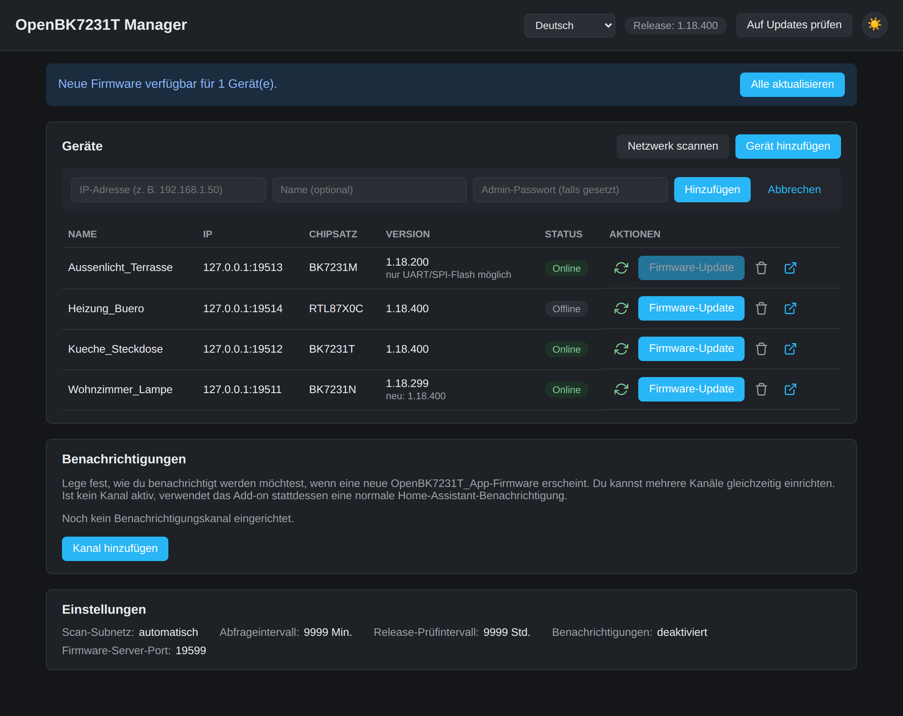
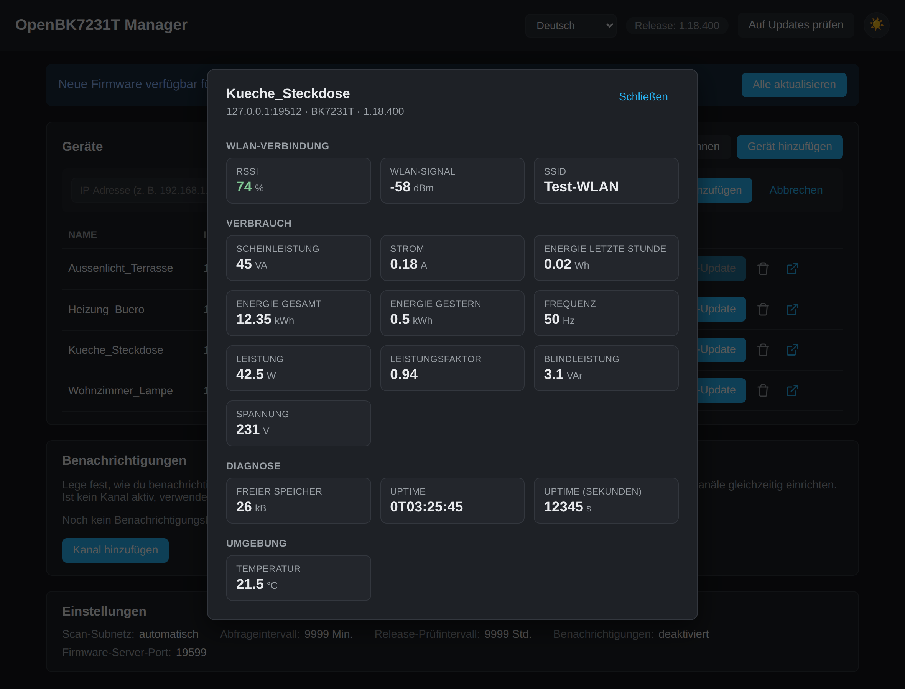

# OpenBK7231T Manager

A Home Assistant **add-on** (not a custom integration) for managing
[OpenBK7231T_App](https://github.com/openshwprojects/OpenBK7231T_App)
(OpenBeken) devices on your local network:

- **Device list**: finds devices via a network scan or manual IP entry,
  and shows name, IP, chipset, firmware version, and online status.
- **Firmware updates**: updates devices over the air (OTA) right from the
  UI — one at a time or for every eligible device at once.
- **Device detail view**: clicking a device's name shows its live sensor
  data, neatly grouped (Wi-Fi connection, power consumption, diagnostics,
  environment), with signal quality (RSSI) color-coded. Both the device
  name and individual sensor labels can be renamed there.
- **Multi-language UI**: German, English, English (US), French, Spanish,
  and Portuguese, switchable from the top bar.
- **Notifications**: periodically checks GitHub for new
  OpenBK7231T_App releases and notifies you — via a Home Assistant
  notification, Telegram, or WhatsApp, with a freely editable message.
- **Dark mode**: follows your system setting automatically, with a manual
  toggle in the top right.
- **ESPHome ↔ OpenBeken migration**: a separate page (its own button in the
  top bar) helps you move a device that currently runs ESPHome over to
  OpenBK7231T_App, and back. It builds a ready-to-flash `.uf2` firmware
  package for the chip/module you pick (using
  [ltchiptool](https://github.com/libretiny-eu/ltchiptool)) to upload
  manually through ESPHome's own OTA update page, reads an existing
  ESPHome YAML config and translates its gpio-based switches, buttons and
  lights into the matching OpenBeken console commands, and can send those
  commands straight to the freshly flashed device's IP address. The page
  never flashes a device on its own — the chip/board is always picked by
  hand, and every step in between is manual, on purpose.
- **Mobile-friendly**: the whole UI - device list, forms, tables, and
  dialogs - adapts to phone-sized screens instead of requiring horizontal
  scrolling.

## Screenshots

| Device list | Sensor details | English UI |
| --- | --- | --- |
|  |  |  |

See [DOCS.md](DOCS.md) (German) for installation and usage instructions,
and [CHANGELOG.md](CHANGELOG.md) for the version history.

## License

[MIT](../LICENSE) — free to use, modify, and redistribute.
